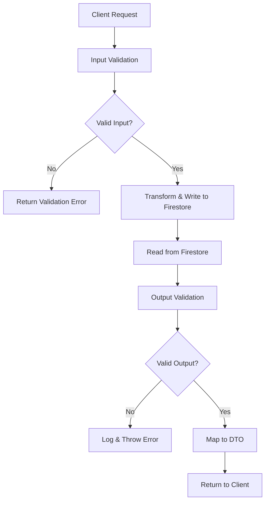

# Dual Validation Strategy: Input + Output Validation

## Overview

Our refactored repository layer implements a **dual validation strategy** that validates data both when writing to Firestore (input validation) and when reading from Firestore (output validation). This provides comprehensive data integrity protection.

## Validation Flow



## Input Validation (Before Writing)

### Purpose: **Prevent Bad Data at Source**

```typescript
// ✅ In BudgetRepository
protected createInputSchema = createBudgetSchema;
protected updateInputSchema = updateBudgetSchema;

async create(userId: string, input: CreateBudgetDto): Promise<BudgetDto> {
  // Validates BEFORE writing to database
  const validatedInput = this.validateCreateInput(input);

  await entityRef.set({
    ...validatedInput,  // Only clean, validated data enters DB
    id,
    createdAt: timestamp,
    updatedAt: timestamp,
  });
}
```

### Benefits:

1. **🛡️ Data Integrity** - Invalid data never enters the database
2. **⚡ Fail Fast** - Immediate feedback to users on invalid input
3. **🔍 Clear Errors** - Detailed validation messages for developers
4. **🚀 Better UX** - Users get instant feedback on form errors

### Example Input Validation Scenarios:

```typescript
// Scenario 1: Invalid budget amount
const invalidBudget = {
  name: "Food",
  maximumSpending: -100, // ❌ Negative amount
  colorTag: "#invalid", // ❌ Invalid hex color
};

// Input validation catches this immediately:
// Error: "maximumSpending: Must be positive, colorTag: Invalid hex color"
```

```typescript
// Scenario 2: Missing required fields
const incompleteBudget = {
  name: "", // ❌ Empty name
  // missing maximumSpending
};

// Input validation prevents database write:
// Error: "name: Required, maximumSpending: Required"
```

## Output Validation (After Reading)

### Purpose: **Ensure Database Integrity**

```typescript
async getById(userId: string, entityId: string): Promise<TDto | null> {
  const entityDoc = await this.getEntityCollection(userId).doc(entityId).get();

  if (!entityDoc.exists) return null;

  // Validates AFTER reading from database
  const validatedData = this.parseDocumentData(entityDoc.data(), entityId);
  return this.mapModelToDto(validatedData);
}
```

### Benefits:

1. **🔧 Corruption Detection** - Catch database inconsistencies
2. **🔄 Migration Safety** - Handle schema changes gracefully
3. **📊 Data Monitoring** - Track validation failures
4. **🐛 Debugging** - Clear error context with document IDs

### Example Output Validation Scenarios:

```typescript
// Scenario 1: Database migration changed field types
// Old document: { maximumSpending: "100.50" }  // string from old schema
// New schema expects: number

// Output validation catches this:
// Error: "BudgetRepository data validation failed (Document ID: budget_123):
//         maximumSpending: Expected number, received string"
```

```typescript
// Scenario 2: Corrupted document missing fields
// Document: { id: "123", name: "Food" }  // missing maximumSpending

// Output validation prevents app crash:
// Error: "BudgetRepository data validation failed (Document ID: budget_123):
//         maximumSpending: Required"
```

## Implementation Examples

### Simple Repository (Budget/Income)

```typescript
export class BudgetRepository extends BaseRepository<...> {
  // ✅ Input validation schemas
  protected createInputSchema = createBudgetSchema;
  protected updateInputSchema = updateBudgetSchema;

  // ✅ Output validation schema
  protected modelSchema = budgetModelSchema;

  // BaseRepository handles all validation automatically!
}
```

### Complex Repository (Transactions)

```typescript
export class TransactionRepository implements ITransactionRepository {
  // ✅ Custom input validation for complex data
  private validateCreateTransactionInput(input: unknown): CreateTransactionDto {
    try {
      return createTransactionSchema.parse(input);
    } catch (error) {
      if (error instanceof z.ZodError) {
        const errorDetails = error.errors
          .map((err) => `${err.path.join(".")}: ${err.message}`)
          .join(", ");
        throw new Error(
          `Transaction create input validation failed: ${errorDetails}`
        );
      }
      throw error;
    }
  }

  async createTransaction(userId: string, input: CreateTransactionDto) {
    return this.executeOperation(async () => {
      // ✅ Validate input first
      const validatedInput = this.validateCreateTransactionInput(input);

      // Process with validated data
      const batch = adminFirestore.batch();
      // ... transaction logic ...

      // ✅ Validate output when reading back
      const validatedData = this.parseTransactionData(docData, id);
      return TransactionMapper.toDto(validatedData);
    });
  }
}
```

## Real-World Protection Scenarios

### 1. **API Input Attack**

```typescript
// Malicious request with script injection
const maliciousInput = {
  name: "<script>alert('hack')</script>",
  maximumSpending: "DROP TABLE budgets;",
  colorTag: "javascript:alert(1)",
};

// ✅ Input validation stops this immediately
// Error: "name: Must be 1-50 characters, maximumSpending: Expected number, colorTag: Invalid hex color"
```

### 2. **Database Corruption Recovery**

```typescript
// Database document somehow got corrupted
// Document: { id: "123", maximumSpending: null, colorTag: { invalid: "object" } }

// ✅ Output validation catches corruption
// Error: "BudgetRepository data validation failed (Document ID: budget_123):
//         maximumSpending: Expected number, received null,
//         colorTag: Expected string, received object"
```

### 3. **Schema Evolution**

```typescript
// Old schema: { target: number }
// New schema: { target: number | null }

// Migration adds .nullable() to schema
export const updatePotSchema = createPotSchema
  .extend({
    target: z.number().positive().nullable(), // ✅ Handles both old and new data
  })
  .partial();
```

## Performance Considerations

### Validation Overhead

- **Input validation**: ~0.1-0.5ms per operation
- **Output validation**: ~0.1-0.5ms per operation
- **Total overhead**: ~1ms per database operation
- **Benefit**: Prevents hours of debugging corrupted data issues

### Optimization Strategies

```typescript
// 1. Schema caching (Zod automatically optimizes)
const cachedSchema = budgetSchema; // Reused across calls

// 2. Conditional validation for performance-critical paths
protected parseDocumentData(rawData: unknown, docId?: string): TModel {
  if (process.env.NODE_ENV === 'development') {
    return this.modelSchema.parse(rawData); // Full validation in dev
  }
  // In production, optionally skip for trusted internal operations
  return rawData as TModel;
}

// 3. Batch validation for bulk operations
const validatedBatch = items.map(item => schema.parse(item));
```

## Monitoring and Alerting

### Validation Failure Tracking

```typescript
protected parseDocumentData(rawData: unknown, docId?: string): TModel {
  try {
    return this.modelSchema.parse(rawData);
  } catch (error) {
    // 📊 Log for monitoring
    logger.warn('Data validation failed', {
      repository: this.contextName,
      docId,
      errors: error.errors,
      rawData: rawData // For debugging (sanitize in production)
    });

    // 🚨 Alert for critical failures
    if (this.isCriticalValidationFailure(error)) {
      alerting.sendAlert('CRITICAL_DATA_VALIDATION_FAILURE', {
        repository: this.contextName,
        docId,
        errors: error.errors
      });
    }

    // Still throw for fail-fast behavior
    throw new Error(this.formatValidationError(error, docId));
  }
}
```

## Testing Strategy

### Input Validation Tests

```typescript
describe("BudgetRepository Input Validation", () => {
  test("should reject invalid budget creation", async () => {
    const invalidInput = {
      name: "", // Empty name
      maximumSpending: -100, // Negative amount
      colorTag: "not-a-color", // Invalid color
    };

    await expect(
      budgetRepository.createBudget("user123", invalidInput)
    ).rejects.toThrow("name: Required, maximumSpending: Must be positive");
  });

  test("should accept valid budget creation", async () => {
    const validInput = {
      name: "Food Budget",
      maximumSpending: 500,
      colorTag: "#FF5733",
    };

    const result = await budgetRepository.createBudget("user123", validInput);
    expect(result).toBeDefined();
    expect(result.name).toBe("Food Budget");
  });
});
```

### Output Validation Tests

```typescript
describe("BudgetRepository Output Validation", () => {
  test("should handle corrupted database document", async () => {
    // Mock corrupted document
    jest
      .spyOn(budgetRepository, "parseDocumentData")
      .mockImplementationOnce(() => {
        throw new Error(
          "BudgetRepository data validation failed: maximumSpending: Required"
        );
      });

    await expect(
      budgetRepository.getBudget("user123", "budget123")
    ).rejects.toThrow("BudgetRepository data validation failed");
  });
});
```

## Migration and Rollout

### Phase 1: Add Input Validation (✅ Completed)

- All repositories now validate input before writing
- Backward compatible - no breaking changes
- Immediate protection against bad data

### Phase 2: Monitor Output Validation

```typescript
// Track validation failures without breaking functionality
protected parseDocumentData(rawData: unknown, docId?: string): TModel {
  try {
    return this.modelSchema.parse(rawData);
  } catch (error) {
    // Log but don't throw in initial rollout
    logger.error('Output validation failed', { docId, error });
    return rawData as TModel; // Fallback to old behavior
  }
}
```

### Phase 3: Strict Validation

- Enable strict output validation
- Fix any discovered data inconsistencies
- Full protection against all data corruption

## Conclusion

The dual validation strategy provides **comprehensive data protection**:

### Input Validation Benefits:

✅ **Prevents corruption** - Bad data never enters database  
✅ **Immediate feedback** - Users get instant error messages  
✅ **Security** - Protects against malicious input  
✅ **Data quality** - Ensures consistent data standards

### Output Validation Benefits:

✅ **Corruption detection** - Catches database inconsistencies  
✅ **Migration safety** - Handles schema evolution gracefully  
✅ **Debugging** - Clear error context with document IDs  
✅ **Monitoring** - Track data quality metrics

This approach ensures **bulletproof data integrity** throughout the entire application lifecycle, from user input to database storage and retrieval.
